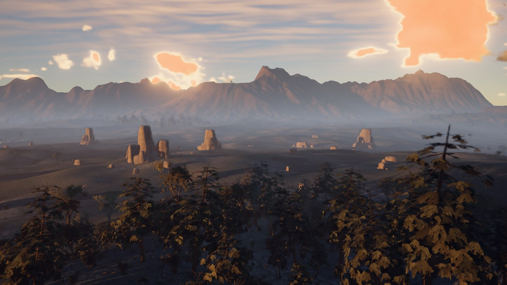
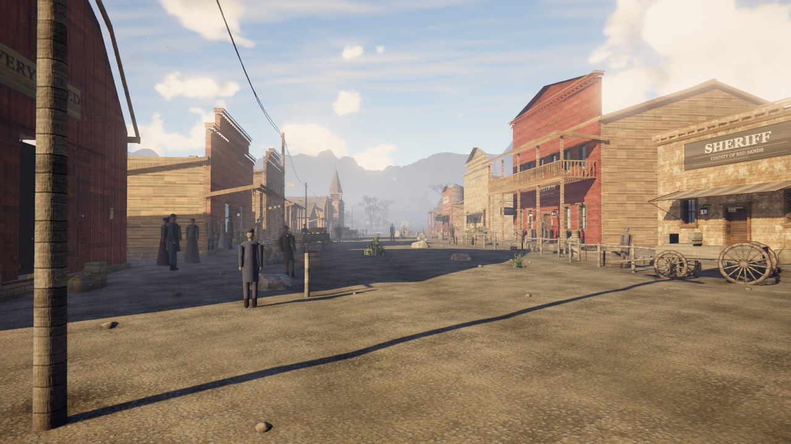
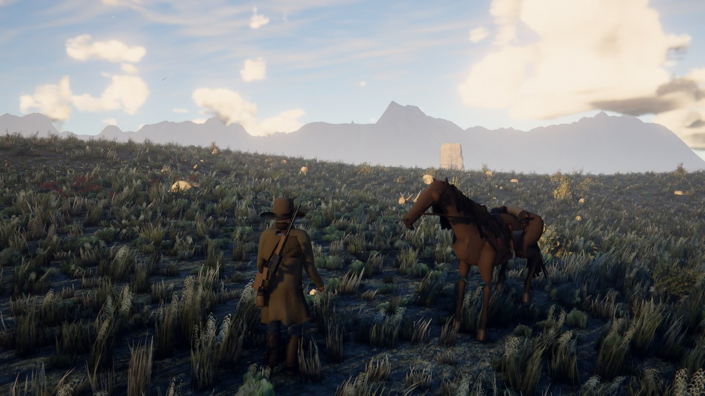
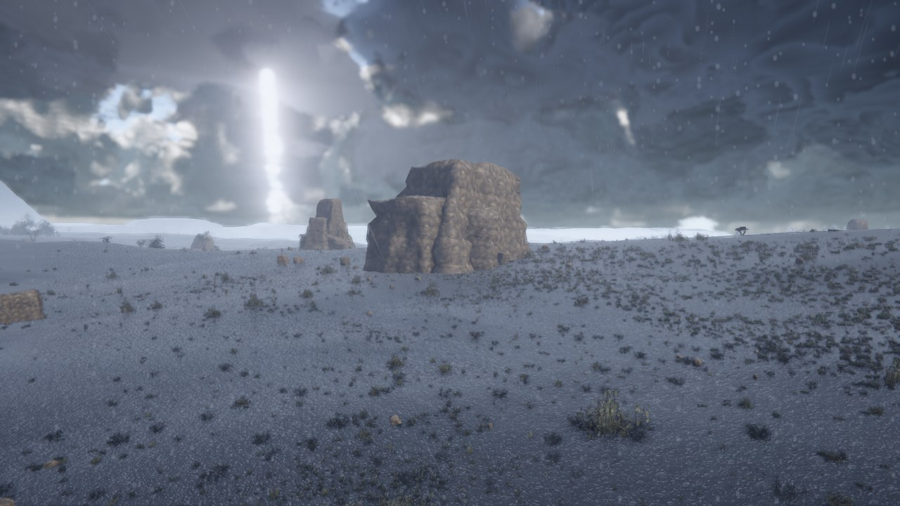
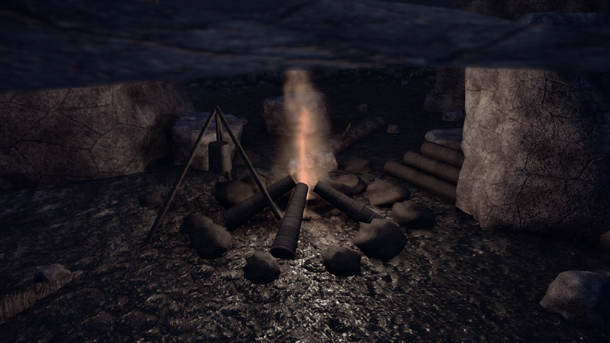

<div align="center">



# RED SANDS

**An open-world western that runs entirely in a browser tab.**

8 km² of eroded frontier · physically-based sky · volumetric weather · horses, hunting and a town
No downloads. No plugins. No art files — every texture, mesh and sound is generated at runtime.

[](https://threejs.org)
[](https://developer.mozilla.org/docs/Web/API/WebGL2RenderingContext)
[](https://vitejs.dev)
[](LICENSE)

</div>

---

## What this is

A procedurally generated open world — terrain, vegetation, weather, town, animals,
audio — rendered in WebGL2 and shipped as a **~480 KB brotli** bundle. There is not a
single `.png`, `.gltf` or `.wav` in the repository. The mountains are hydraulically
eroded at load, the sky is a physical scattering integral, the rifle report is
synthesised from noise, and the echo you hear after it is computed by marching the
actual heightfield for reflectors.

<table>
<tr>
<td width="50%"></td>
<td width="50%"></td>
</tr>
<tr>
<td width="50%"></td>
<td width="50%"></td>
</tr>
</table>

## Play

```bash
npm install
npm run dev
```

Open <http://localhost:5173>. Click to capture the pointer.

| | |
|---|---|
| **W A S D** | move |
| **Shift** | run / gallop |
| **Ctrl** | crouch (quieter — animals hear you) |
| **E** | mount / dismount · skin a carcass |
| **Right mouse** | raise the rifle |
| **Shift** *(aiming)* | hold breath to steady |
| **Left mouse** | fire |
| **R** | reload |

Add `?quality=low|medium|high|ultra` to force a preset.

## Under the hood

**Sky and light.** A Hillaire-style scattering chain — transmittance,
multiple-scattering and sky-view LUTs in half-float targets, Rayleigh + Mie with
Cornette-Shanks phase and an ozone absorption layer. The sun follows a NOAA solar
ephemeris, so it rises in the east on an arc that is correct for the latitude and
day of year, and its colour comes from the extinction integral along its own slant
path rather than a keyframed gradient. Earth's shadow and the Belt of Venus fall out
of a planetary-shadow test in the raymarch. At night, 6,600 stars from a
deterministic catalogue with power-law magnitudes and blackbody colours rotate about
the celestial pole, behind a Milky Way built in true galactic coordinates.

**Terrain.** Domain-warped ridged multifractal, then **real hydraulic erosion** —
droplet simulation with sediment capacity, deposition and evaporation — which is what
carves the dendritic drainage networks and deposits alluvial fans at the range feet.
Thermal erosion collapses anything past the talus angle into scree. The resulting
flow-accumulation map then drives where rivers run, where vegetation is densest, and
where debris collects.

**Rendering.** Cascaded shadow maps with PCSS contact hardening and texel-snapped,
hysteresis-quantised cascade fits; GTAO; TAA with YCoCg variance clipping; SSR;
raymarched volumetric clouds with a deep-scattering floor (cloud droplets have albedo
≈ 0.9999 — light entering is redirected, not absorbed, and modelling every octave as
Beer absorption is what makes big clouds go grey); AgX tonemapping with a strictly
monotone highlight shoulder.

**Materials.** 35 procedural PBR surfaces baked across a worker pool at boot, each
authored in three explicit frequency bands (metres / decimetres / millimetres) with
cavity dirt and edge wear solved over the finished height field.

**Life.** Animals perceive by sight, hearing *and* scent — stand upwind of a deer
herd at 125 m and they are unaware; cross to the other side of the wind and they are
fleeing within a second. Horses have four gaits with correct footfall sequences and
foot IK. The rider's arms solve to grip sockets on the rifle itself, so the muzzle
points exactly where the shot goes, on foot or from the saddle.

**Audio.** Entirely synthesised WebAudio — no samples. The rifle is five layers, and
its echo schedule comes from marching the real terrain for reflectors, so a shot on
open ground returns at `2d/c` from a ridge 315 m away.

## Architecture

Twenty systems on a fixed lifecycle, sharing one frozen context object:

```
src/core/       Engine, Context (the shared contract), Config
src/materials/  procedural PBR library + worker bake pool
src/world/      Terrain · Vegetation · Scatter · Town
src/render/     Sky · Clouds · Water · Lighting · Particles · PostFX
src/sim/        TimeOfDay · Weather · Physics · Wildlife
src/player/     Player · Horse · Weapon · CameraRig
src/audio/      synthesised beds + foley
src/ui/         HUD
```

Every system implements `init / update / lateUpdate / resize / dispose` and
communicates only through `ctx` and events. Ownership of every shared field is
documented in [`docs/CONTRACTS.md`](docs/CONTRACTS.md) — that file is the reason
twenty independently-written systems compose at all.

## How it was judged

The interesting part of this repo may be the test rig rather than the game. Since
"does it look good" is not a unit test, the project grew a set of instruments that
answer it mechanically. They live in [`tools/`](tools) and are documented in
[`docs/PROCESS.md`](docs/PROCESS.md).

| Tool | What it catches |
|---|---|
| `capture.mjs` | renders 10 canonical shots headless on the real GPU, deterministically |
| `metrics.py` | a **regression suite for images** — every defect ever found, permanently asserted |
| `motion.py` | temporal artifacts: shimmer, LOD pop, ghosting, sun-driven stepping |
| `flicker.mjs` | camera-motion flicker binned by true camera-relative distance |
| `abcompare.py` | blind A/B, and a champion ladder against the previous build |
| `scout.mjs` | adversarial camera — hunts the ugliest frame in the world |

`metrics.py` is the one worth stealing. Every gate in it traces to a defect that was
once real here: a frame that rendered **three sun discs**; aerial perspective that was
chromatically *inverted*, so distant ridges came out warmer than the foreground; a
storm whose darkest pixel was mid-grey. Each was found by eye once, then encoded as an
assertion so it could never come back silently. Run it against an early build and it
independently rediscovers them.

A few things it taught, written up in `docs/PROCESS.md`:

- **A gate that has never fired is not proven.** Every threshold here was calibrated
  by replaying it against the build where the defect was live.
- **Determinism controls create blind spots.** The capture harness pauses the clock
  for reproducibility — which made every sun-rate-driven defect invisible until a
  human found one by playing.
- **An optimisation can invalidate an instrument.** Removing two blocking readbacks
  also removed the accidental GPU sync that frame timing depended on; the number kept
  looking plausible while measuring nothing.

## Deploying

Configured for Vercel out of the box — [`vercel.json`](vercel.json) sets immutable
caching on fingerprinted assets, `must-revalidate` on the entry document, and baseline
security headers.

```bash
npx vercel --prod
```

If you deploy to a different domain, update the four absolute URLs in `index.html`;
Open Graph images cannot be relative.

## Building on it

Read [`docs/CONTRACTS.md`](docs/CONTRACTS.md) first — it defines the frozen
interfaces, the ownership table, and the art direction. Then:

```bash
npm run dev            # play it
npm run capture:fast   # render the canonical shots (1280×720, ~4× cheaper)
npm run metrics        # run the image regression suite
npm run motion         # temporal artifact gates
npm run scout          # adversarial camera sweep
```

Two rules keep it coherent: **no external assets** (if you need a texture, generate
it) and **no `Math.random()`** (use the seeded `rng` from `src/core/Context.js`, or
captures stop being reproducible and every instrument above stops working).

## Notes

Built as an experiment in how far a browser can be pushed with a procedural-only
budget, and in whether "looks good" can be made into a measurable, regression-tested
property.

Red Dead Redemption 2 was used as the quality bar during development — reference
frames were kept locally for side-by-side critique and are **not** part of this
repository. This project is unaffiliated with and unendorsed by Rockstar Games.

## License

[MIT](LICENSE).
